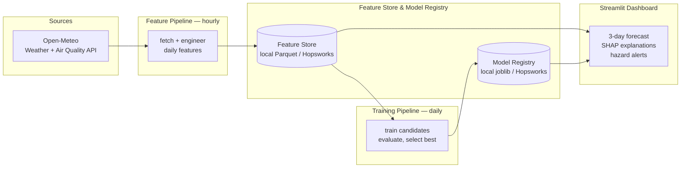

# Pearls AQI Predictor

Predict the Air Quality Index (AQI) for the next 3 days, city by city, on a
100% serverless stack — free weather/AQI data in, an hourly feature
pipeline, a daily training pipeline, and an interactive forecast dashboard
out.

```
observed AQI today  →  engineered daily features  →  3 regressors (day+1, day+2, day+3)  →  dashboard + hazard alerts
```

## Contents

- [Quickstart](#quickstart)
- [Architecture](#architecture)
- [Project structure](#project-structure)
- [Configuration](#configuration)
- [Running the pipelines](#running-the-pipelines)
- [The dashboard](#the-dashboard)
- [Automation (CI/CD)](#automation-cicd)
- [Deployment](#deployment)
- [Testing](#testing)
- [Design decisions & limitations](#design-decisions--limitations)
- [License](#license)

## Quickstart

Requires Python 3.10+. No API keys or account signups are required for the
default configuration — the free, key-less [Open-Meteo](https://open-meteo.com)
API and a local Parquet/joblib store are used out of the box.

```bash
git clone <this-repo-url> pearls-aqi-predictor
cd pearls-aqi-predictor

python -m venv .venv # optional but recommended
.venv\Scripts\activate  # optional but recommended

pip install -r requirements.txt
pip install -e .

cp .env.example .env   # optional: only needed to change defaults

# 1. Backfill ~4 months of history for the default cities
python scripts/run_backfill.py --lookback-days 120

# 2. Train + register the 3 forecasting models (day+1, day+2, day+3)
python scripts/run_training_pipeline.py

# 3. Launch the dashboard
streamlit run app/streamlit_app.py
```

...or run all three in one go:

```bash
python scripts/run_full_demo.py --cities islamabad,delhi,london --lookback-days 120
```

The dashboard also has a **"First-time setup / refresh data"** panel in the
sidebar that runs steps 1–2 for you with one click, so you can skip the
command line entirely if you'd rather just launch `streamlit run` first.

## Architecture



**Why Open-Meteo instead of AQICN/OpenWeather?** The brief names AQICN /
OpenWeather as *examples* and explicitly invites exploring alternatives.
Open-Meteo's [Air Quality API](https://open-meteo.com/en/docs/air-quality-api)
requires no signup or API key, has generous rate limits, returns a properly
computed US AQI (`us_aqi`) directly (backed by the CAMS atmospheric
composition model), and its [Historical Weather API](https://open-meteo.com/en/docs/historical-weather-api)
covers matching weather features back to 1940. That combination is what
makes this project runnable the moment you `pip install` — nobody has to
create an account before the pipelines produce anything. An `OpenWeatherClient`
adapter is still included (`src/aqi_predictor/data/api_client.py`) behind
the same interface, for anyone who wants to switch.

**Why per-horizon models instead of one multi-output model?** Three
independent regressors (day+1, day+2, day+3) are trained rather than one
model producing all three outputs at once. Each horizon has a different
error profile (day+3 is inherently harder to predict than day+1), and this
lets the training pipeline pick the *best* candidate algorithm
independently per horizon rather than forcing one algorithm to compromise
across all three. See `REPORT.md` for the fuller reasoning and trade-offs.

## Project structure

```
pearls-aqi-predictor/
├── src/aqi_predictor/
│   ├── config.py                  # cities, AQI categories, paths, env-driven settings
│   ├── data/
│   │   ├── api_client.py          # OpenMeteoClient (default) + OpenWeatherClient
│   │   └── aqi_math.py            # EPA US-AQI breakpoint math (for the OpenWeather adapter)
│   ├── features/
│   │   ├── engineering.py         # daily aggregation, time/lag/rolling features, targets
│   │   └── feature_store.py       # LocalFeatureStore (default) + HopsworksFeatureStore
│   ├── models/
│   │   ├── trainer.py             # candidate models, time-based split, evaluation
│   │   ├── registry.py            # LocalModelRegistry (default) + HopsworksModelRegistry
│   │   └── forecaster.py          # latest features + registered models -> 3-day forecast
│   ├── explainability/shap_explainer.py   # global + per-prediction SHAP explanations
│   ├── alerts/aqi_alerts.py       # hazardous-AQI detection + Slack webhook
│   └── pipelines/                 # orchestration: feature / backfill / training pipelines
├── app/streamlit_app.py           # the dashboard
├── scripts/                       # thin CLIs: run_feature_pipeline.py, run_backfill.py, ...
├── notebooks/01_eda.ipynb         # exploratory data analysis
├── tests/                         # pytest suite (63 tests, no network required)
├── .github/workflows/             # hourly feature pipeline, daily training pipeline, CI tests
├── data/local_store/              # local feature store (Parquet) + model registry (joblib)
├── REPORT.md                      # detailed write-up: design decisions, evaluation, limitations
└── requirements.txt / pyproject.toml
```

## Configuration

Everything is optional — copy `.env.example` to `.env` to override any of
these; the defaults require no signup.

| Variable | Default | Purpose |
|---|---|---|
| `AQI_DATA_PROVIDER` | `open_meteo` | `open_meteo` (free, no key) or `openweather` (needs `OPENWEATHER_API_KEY`) |
| `OPENWEATHER_API_KEY` | _(empty)_ | Only used if `AQI_DATA_PROVIDER=openweather` |
| `FEATURE_STORE_BACKEND` | `local` | `local` (Parquet/joblib on disk) or `hopsworks` (managed) |
| `HOPSWORKS_API_KEY` / `HOPSWORKS_PROJECT_NAME` | _(empty)_ | Only used if `FEATURE_STORE_BACKEND=hopsworks` |
| `SLACK_WEBHOOK_URL` | _(empty)_ | If set, hazardous-AQI alerts are also posted to Slack |
| `LOG_LEVEL` | `INFO` | Standard Python logging level |

Cities are configured in `src/aqi_predictor/config.py` (`DEFAULT_CITIES`):
Islamabad, Lahore, Delhi, Beijing, London, Los Angeles, São Paulo, and
Lagos, by default. Add or edit entries there (each needs a unique `key`,
display `name`, and `latitude`/`longitude`) — every pipeline and the
dashboard picks up new cities automatically.

## Running the pipelines

```bash
# Feature pipeline: fetch recent data, recompute features, upsert into the store
python scripts/run_feature_pipeline.py                     # all configured cities
python scripts/run_feature_pipeline.py --cities islamabad,delhi --past-days 5

# Backfill: build up historical data for training (run this first!)
python scripts/run_backfill.py --lookback-days 180
python scripts/run_backfill.py --cities islamabad --start-date 2025-01-01 --end-date 2025-06-01

# Training: fetch features, train + evaluate candidates, register the best per horizon
python scripts/run_training_pipeline.py
```

Every script accepts `--cities` as a comma-separated list of city keys
(`python -c "from aqi_predictor.config import CITY_BY_KEY; print(list(CITY_BY_KEY))"`
to list them) and falls back to every configured city if omitted.

## The dashboard

```bash
streamlit run app/streamlit_app.py
```

Shows, per selected city: current conditions, the day+1/+2/+3 forecast
(colour-coded to the US EPA AQI scale), a 30-day historical trend chart
with the forecast overlaid, a SHAP explanation for "why this forecast"
(day+1), global SHAP feature importance, the held-out-test-set model
performance table, and hazard banners for any forecast day reaching
"Unhealthy" (AQI ≥ 151) or worse.

## Automation (CI/CD)

Three GitHub Actions workflows are included under `.github/workflows/`:

- **`feature_pipeline.yml`** — runs hourly (`0 * * * *`).
- **`training_pipeline.yml`** — runs daily (`0 3 * * *`).
- **`tests.yml`** — runs the pytest suite on every push/PR.

Both pipeline workflows work with **zero configuration** on the default
`local` backend: they run the pipeline and commit the updated
`data/local_store/**` files straight back into the repo (with
`[skip ci]`), so the "feature store" and "model registry" simply live as
tracked files in your GitHub repo — genuinely free, no external service
required. To enable them:

1. Push this repo to GitHub.
2. Go to **Settings → Actions → General** and confirm Actions are enabled.
3. (Optional) **Settings → Actions → General → Workflow permissions** →
   "Read and write permissions", so the workflows can push their commits.
4. That's it — the first hourly/daily run will populate `data/local_store/`.

To use the managed Hopsworks backend instead (recommended for a "properly"
serverless deployment, and required if you deploy the dashboard somewhere
with a read-only or ephemeral filesystem — see below):

1. Create a free project at [app.hopsworks.ai](https://app.hopsworks.ai) and
   generate an API key.
2. In your GitHub repo, add secret `HOPSWORKS_API_KEY` and repository
   variables `FEATURE_STORE_BACKEND=hopsworks` and `HOPSWORKS_PROJECT_NAME`.
3. `pip install hopsworks` locally too if you want to run pipelines from
   your machine against the same store.

## Deployment

- **Dashboard**: [Streamlit Community Cloud](https://streamlit.io/cloud) is
  the natural free host — point it at `app/streamlit_app.py`. Its
  filesystem is ephemeral across redeploys, so for a dashboard that stays
  in sync with the automated pipelines, either (a) set `FEATURE_STORE_BACKEND=hopsworks`
  so both the GitHub Actions pipelines and the deployed app read from the
  same managed store, or (b) keep the `local` backend and have the app's
  own container periodically `git pull` (simplest if you're fine with the
  dashboard only refreshing on redeploy).
- **Pipelines**: GitHub Actions (above) — no server to manage.
- **Everything is stateless compute + external storage**, which is what
  makes the stack "serverless": nothing here requires a long-running server
  process outside of the dashboard itself.

## Testing

```bash
pytest            # 63 tests, all offline (HTTP calls are mocked with `responses`)
pytest -v         # verbose
```

Coverage includes feature engineering (lag/rolling correctness, no
cross-city leakage), the EPA AQI breakpoint math, alert threshold logic,
the API client's JSON parsing (against payloads shaped like the real
Open-Meteo/OpenWeather docs), model training/evaluation/selection, the
model registry's save/load round-trip, and the forecaster's date
arithmetic and error handling.

## Design decisions & limitations

See **[REPORT.md](REPORT.md)** for the full write-up: EDA findings, why
each modelling and architecture choice was made, evaluation methodology,
explainability approach, and known limitations / future work.

## License

MIT — see [LICENSE](LICENSE).
